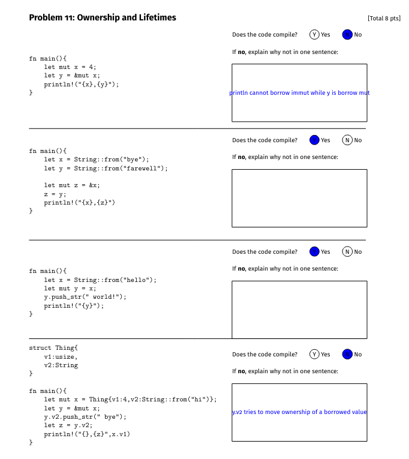

# Discussion 13 - Friday, December 5th

## Reminders

- Final is Dec. 16 @ 6:30pm (rooms and logistics coming soon!)
- Last project due December 12th @ 11:59pm
- Quiz today :)

### Choose from the following topics: Borrowing, Scopes/Lifetimes, Garbage Collection

## Ownership and Borrowing
- [Rust Book chapter](https://doc.rust-lang.org/book/ch04-00-understanding-ownership.html)

- See also [Last week's discussion](https://github.com/cmsc330fall25/fall25/tree/main/discussions/d12_rust)

Ownership is one way that Rust is able to clear data without use of a garbage collector. It describes how a variable "owns" a piece of data on the heap, and once the owner goes out of scope, the data is dropped. 

Ownership can be transferred.

```rust
let x = String::from("hello"); // x owns hello

let y = x; // y takes ownership, x is now invalid.
```

But this is not always what we want! For example: 

```rust
fn main() {
    let x = String::from("some_string");
    let l = custom_len(x);
    
    println!("{} is {} letters long", x, l); // causes an error   
}

fn custom_len(str: String) -> usize {
    return str.len();
}
```

Will not compile! Ownership is given to the length function, and the string then goes out of scope. 

We can remedy this with borrowing:

```rust
fn main() {
    let x = String::from("some_string");
    let l = custom_len(&x);
    
    println!("{} is {} letters long", x, l); // no longer an error  
}

fn custom_len(str: &String) -> usize {
    return str.len();
}
```

Now, the len function borrows x, then returns ownership once it has completed. 

## Scopes/Lifetimes

**Scopes** of a variable extend as far as defined/freed (between curly braces). **Lifetimes** span as long as the variable lives. A variable's lifetime ends the line after the last time it is used.

```rust
{
    let x = 3; 
    { // x lifetime ends
        let y = 4;
        println!("{}", y);
    } // scope of y ends, y lifetime ends
    
    let z = 5;
    println!("Hello World!"); // z lifetime ends
} // scope of x, z ends
```

We cannot have an immutable/mutable reference at the same time. 
```rust
fn main() {
    let mut x = String::from("Hello");
    x.push_str(" World");
    {
        let y = &x;
        // x.push_str(", I am an alien!"); // error! x is turned to an immutable reference
        println!("{} and {} can only read, no write", x, y);
        x.push_str(", I am an alien!"); // y lifetime ends so this is ok
    }
    
    x.push_str("!");
    println!("{} is still valid", x);
}
```

In the above, x becomes immutable for as long as y lives (until line 6). Here is another example with &mut.

```rust
fn main() {
    let mut s1 = String::from("hello");
    { 
        let s2 = &s1;
        //s2.push_str(" there"); //disallowed; s2 immutable
    }   //s2 dropped
    let s3 = &mut s1; //ok since s1 mutable
    s3.push_str(" there"); //ok since s3 mutable
    // println!("String is {}",s1); //NOT OK, s3 has mutable borrow
    println!("String is {}",s3); //ok; 
    println!("String is {}",s1); //ok; s3 dropped
}
```

## Exercises

### Ownership/Borrowing
- From Rust quiz last semester:


<details>
<summary>Solutions</summary>
    
    - b 
    - b
    - None
    - s
</details>

- From Final Fall 2024:


<details>
<summary>Solutions</summary>



</details>

- [Spring 2025 problem](https://bakalian.cs.umd.edu/assets/past_assignments/spring24final.pdf)

### General Debugging

Each of the functions in [`debug.rs`](https://play.rust-lang.org/?version=stable&mode=debug&edition=2021&gist=4e4c4ae42395098a2aefabbcae925c08) has an error. Find the errors and fix them.

Solutions are in [`debug_solutions.rs`](https://play.rust-lang.org/?version=stable&mode=debug&edition=2021&gist=f1712758d23e982589c3c13cc4f06535)!


## Garbage Collection

In lecture, we learned about three main ways to do garbage collection:

* **Reference Counting** - Keep track of how many references point to a piece of memory, and free that memory once the counter reaches 0.
* **Mark & Sweep** - Has two phases, mark and sweep. In the mark phase, we mark all chunks of memory reachable via the stack. In the sweep phase, we go through the heap and deallocate all non-marked (non-reachable) chunks of memory. 
* **Stop & Copy** - Similar to Mark & Sweep, but instead of freeing unreachable heap memory segments, we copy reachable segments to an alternate partition. Once a partition is completely freed from stack references, we swap to using that partition.

## Exercises

### Reference Counting

Consider the following stack + heap layouts. For each, answer the following:
1. What would a reference counter diagram look like at time of first diagram?
2. What would it look like after each variable is popped off the stack?


<details>
  <summary>Solution!</summary>


    
For the following assume `d`s are arbitrary data on the heap.
    


</details>

### Mark & Sweep

Consider the following stack + heap layouts. For each, answer the following:
1. What would a mark and sweep diagram look like if called at time of first diagram?
2. What would it look like after each variable is popped off the stack?


For the following assume `d`s are arbitrary data on the heap.


<details>
  <summary>Solution!</summary>


    


</details>

### Stop and Copy

Consider the following stack + heap layout. For each, answer the following:
1. What would a stop and copy diagram look like if called at time of first diagram?
2. What would it look like after each variable is popped off the stack?
3. \+ how are these different than mark and sweep?


\* **NOTE for solutions**: For the first solution (to Q1 above), there is only one solution. For the rest, there is a simplified and  a detailed version. The detailed version is most accurate, the simplified version hides some inaccessible data from previous passes to help focus on what has just happened in that pass. Simplified version is more similar to project 7.
    
In the detailed versions, the blue data is overwriting what was in that spot before. Recall that in stop and copy nothing is ever freed, just overwritten!

<details>
  <summary>Solution!</summary>
    


    

</details>


## Resources

- [Spring23 Discussion 11 - Rust](https://github.com/cmsc330-umd/spring23/tree/main/discussions/d11_rust)
- [Rust Playground](https://play.rust-lang.org/)
- [Rust Book](https://doc.rust-lang.org/book/)
- [Rust Book - Defining and Instantiating Structs](https://doc.rust-lang.org/book/ch05-01-defining-structs.html)
- [Rust Book - Defining an Enum](https://doc.rust-lang.org/book/ch06-01-defining-an-enum.html)
- [Rust Book - Traits](https://doc.rust-lang.org/book/ch10-02-traits.html)
- [Cliff's Garbage Collection Notes](https://bakalian.cs.umd.edu/assets/notes/gc.pdf)
- [Anwar's Garbage Collection Slides](https://bakalian.cs.umd.edu/assets/slides/23-memory-management.pdf)

